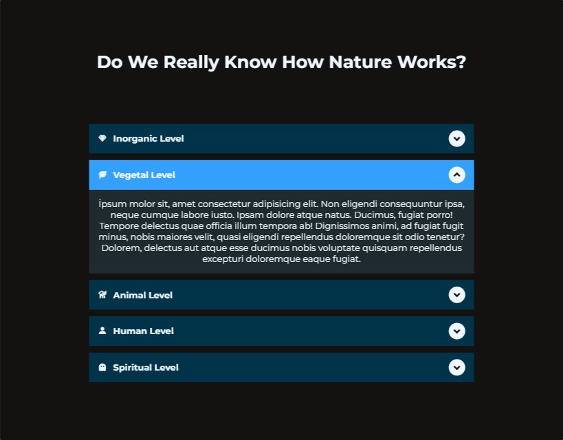

# Responsive Accordion

Responsive accordion is a small Vanilla JS project to get better at JavaScript DOM manipulation.

## Tech Stack

**Client:** HTML, CSS, JavaScript

## Lessons Learned

- For separation of concerns,I should style element within css file rather than with js.

## Project JS Goals

- Select accordion buttons
- Add event listener to buttons
- On active state, display content panel
- On active state, change button bg color
- On active state, rotate arrow icon inside button

## Live

You can check the project here. [▶ Responsive Accordion Live](https://res-accordion.netlify.app).
